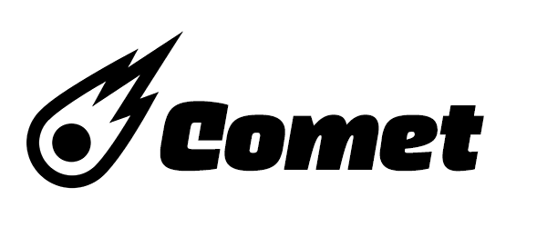
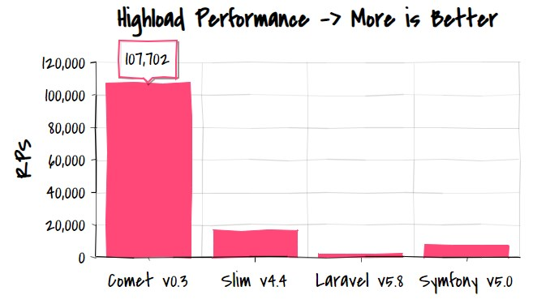
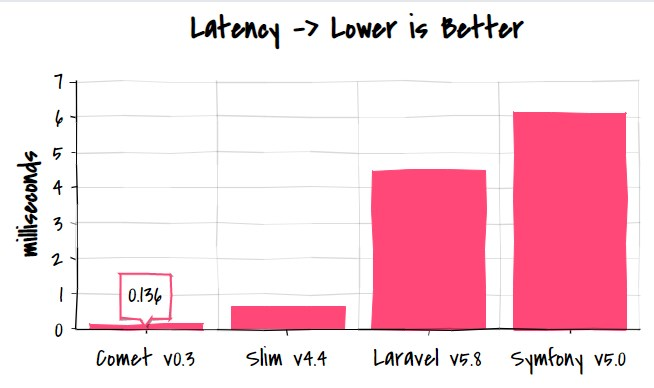

<p align="center">
  
</p>

# Comet

Comet is a modern PHP framework for building blazing fast REST APIs, CRUDs, admin panels and microservices. 

## What's new in Comet v2

- Performance improvments - up to 20-30% faster than first version!
- Embedded secure web-server to serve static content like images, CSS styles and JS scripts
- Extended session support for complex authentication and authorizathion services
- Hassle-free out-of-the-box integration with full-featured Auth library

## Superpowers at your disposal

- Blazing fast with 100K HTTP requests per second and ~0.1 ms latency on commodity cloud hardware
- Really cross-platform, works like a charm on Linux, MacOS and Windows 7/10
- Embedded web-server to serve static content like CSS/JS and images  
- Integration with full-featured auth library [Comet\Auth](https://github.com/gotzmann/auth) for users management
- Embedded validation and testing features you could use with easy to create robust software  
- Based on bullet-proof components from Guzzle, SlimPHP and Workerman
- Extendable with Composer: use ORM and templating engine of your choice (Eloquent and Twig are recommended)
- PSR compliant with native implementations of all PSR-7 interfaces and PHP sessions abstraction
- Has its own efficient HTTP client with simple programming interface 

## Standing on the shoulders of giants

Comet combines all superpowers of Slim PHP, Guzzle and Workerman and mix its own magic to achieve 10x speed up.

[Slim](https://github.com/slimphp/Slim) is a micro-framework that helps write web applications and APIs based on modern PSR standards.

[Guzzle](https://github.com/guzzle) is a set of PHP components to work with HTTP/1.1 and HTTP/2 services.

[Workerman](https://github.com/walkor/Workerman) is an asynchronous event-driven framework to build fast and scalable network applications. 

Comet allows you natively use all the classes and methods of Slim framework: http://www.slimframework.com/docs/v4/

### Performance

PHP is often criticized for its low throughput and high latency. But that is not necessarily true for modern frameworks. Let's see how Comet outperforms others.

<p align="center">
  
</p>

<h5 align="center">
  Benchmarking stripped versions of frameworks with no ORM under 1,000 concurrent connections
</h5>

As you can see, the right architecture provides it with tenfold advantage over Symfony and other popular frameworks. 

### Latency

How long it takes to get response from API often is even more important than overall service throughput. And that is where Comet really shines!

<p align="center">
  
</p>

<h5 align="center">
  Response latency of minimal versions of popular PHP frameworks under series of serial web requests
</h5>

Comet provides sub-millisecond latency for typical scenarios. Even under hard pressure of thousand concurrent connections it can compete with frameworks of compiled platforms like Go and Java.

### Too good to be true? 

You may run all benchmarks on your own to be sure charts are not scam: https://github.com/gotzmann/benchmarks

## Basics

### Installation

It is recommended that you use [Composer](https://getcomposer.org/) to install Comet.

```bash
$ composer require gotzmann/comet
```

This will install framework itself and all required dependencies. Comet requires PHP 7.2 or newer.

### Hello Comet

Create single app.php file at project root folder with content:

```php
<?php
require_once __DIR__ . '/vendor/autoload.php';

$app = new Comet\Comet();

$app->get('/hello', 
    function ($request, $response) {              
        return $response
            ->with("Hello, Comet!");
});

$app->run();
```

Start it from command line:

```bash
$ php app.php start
```

Then open browser and type in default address http://localhost - you'll see hello from Comet!

### Simple JSON Response

Let's start Comet server listening on custom host:port and returning JSON payload.

```php
<?php
require_once __DIR__ . '/vendor/autoload.php';

$app = new Comet\Comet([
    'host' => '127.0.0.1',
    'port' => 8080,
]);

$app->get('/json', 
    function ($request, $response) {        
        $data = [ "message" => "Hello, Comet!" ];
        return $response
            ->with($data);
});

$app->run();
```

Start browser or Postman and see the JSON resonse from GET http://127.0.0.1:8080

## Authorization, authentication, ACL and users management

There special full featured [Comet/Auth](https://github.com/gotzmann/auth) library which allows you to create secure and sofisticated scenarios for user registration, email checking, password management, role-based access and so on.

Please refer for the corresponging documentation on how to use Comet\Auth in your own projects.

## Validation

Comet validation engine is based on clean yet powerful [Rakit Validation](https://github.com/rakit/validation) library.

To start using Comet Validation in your own project, specify use statement:

```php
use Comet\Validator;
```

You can use different predefined and user-defined rules, custom error messages and controller logic to deal with errors. Look at this example:  

```php
$payload = (string) $request->getBody();

// Prior to 7.3 PHP does not support RFC3339_EXTENDED (milliseconds are broken)
$version = explode('.', PHP_VERSION);
$dateFormat = ($version[0] == 7 && $version[1] >= 3) ? \DateTime::RFC3339_EXTENDED : "Y-m-d?H:i:s.???P";

$rules = [
    'paymentOrderId' => 'required',
    'customerId'     => 'required|uuid',
    'clientKey'      => 'required|alpha_dash',
    'paymentDate'    => 'required|date:' . $dateFormat,
];

$messages = [
    'required'   => 'field is required',
    'alpha_num'  => 'only alphabet and digits allowed',
    'alpha_dash' => 'only alphabet chars, digits and dashes are allowed',
    'uuid'       => 'UUID is wrong',
    'date'       => 'should be RFC3339 date',
];        

$validator = new Validator;
$validation = $validator->validate($payload, $rules, $messages);        
if (count($validation->getErrors())) {
    return $response
        ->with($validation->getErrors(), 400);
}        
```

Please refer to the docs about [Rakit Validation](https://github.com/rakit/validation) for more information on available rules and possibilities.

## Advanced Topics

### PSR-4 and Autoloading

Before you proceed with complex examples, be sure that your composer.json contains "autoload" section like this:

```bash
{
    "require": {
        "gotzmann/comet": "^1.0",
    },
    "autoload": {
        "psr-4": { "App\\": "src/" }
    }
}
```    

If not, you should add the section mentioned above and update all vendor packages and autoload logic by command:

```bash
$ composer update
```    

### Controllers

Create src/Controllers/SimpleController.php:

```php
<?php
declare(strict_types=1);

namespace App\Controllers;

use Comet\Request;
use Comet\Response;

class SimpleController
{    
    private static $counter = 0;

    public function getCounter(Request $request, Response $response, $args)
    {
        $response->getBody()->write(self::$counter);  
        return $response->withStatus(200);
    }

    public function setCounter(Request $request, Response $response, $args)    
    {        
        $body = (string) $request->getBody();
        $json = json_decode($body);
        if (!$json) {
            return $response->withStatus(500);
        }  
        self::$counter = $json->counter;
        return $response;        
    }
}  
```    

Then create Comet server app.php at project root folder:

```php
<?php
declare(strict_types=1);

use Comet\Comet;
use App\Controllers\SimpleController;

require_once __DIR__ . '/vendor/autoload.php';

$app = new Comet([
    'host' => 'localhost',
    'port' => 8080,    
]);

$app->setBasePath("/api/v1"); 

$app->get('/counter',
    'App\Controllers\SimpleController:getCounter');

$app->post('/counter',    
    'App\Controllers\SimpleController:setCounter');

$app->run();
```

Now you are ready to get counter value with API GET endpoint. And pay attention to '/api/v1' prefix of URL:

GET http://localhost:8080/api/v1/counter

You can change counter sending JSON request for POST method:

POST http://localhost:8080/api/v1/counter with body { "counter": 100 } and 'application/json' header.

Any call with malformed body will be replied with HTTP 500 code, as defined in controller.

## Deployment

### Debugging and Logging

Comet allows you to debug application showing errors and warnings on the screen console. When you move service to the production it better to use file logs instead. Code snippet below shows you how to enable on-the-screen debug and logging with popular Monolog library: 

```php
<?php
declare(strict_types=1);

use Comet\Comet;
use Monolog\Logger;
use Monolog\Handler\StreamHandler;
use Monolog\Formatter\LineFormatter;

require_once __DIR__ . '/vendor/autoload.php';

$formatter = new LineFormatter("\n%datetime% >> %channel%:%level_name% >> %message%", "Y-m-d H:i:s");
$stream = new StreamHandler(__DIR__ . '/log/app.log', Logger::INFO);
$stream->setFormatter($formatter);
$logger = new Logger('app');
$logger->pushHandler($stream);

$app = new Comet([
    'debug' => true,
    'logger' => $logger,
]);

$app->run();
```

### Docker

Please see [Dockerfile](Dockerfile) at this repo as starting point for creating your own app images and containers.

### Nginx

If you would like to use Nginx as reverse proxy or load balancer for your Comet app, insert into nginx.conf these lines:

```php
http {
 
    upstream app {
        server http://path.to.your.app:port;
    }
  
    server {
        listen 80;
         location / {
            proxy_pass         http://app;
            proxy_redirect     off;
        }
    }
}    
```

## FAQ

**Got error `stream_socket_server(): unable to connect to tcp://0.0.0.0:80 (Permission denied)` trying to start Comet under my Ubuntu?**

Comet needs to be run as root in order to bind to port 80 or any other port lower than 1000. So either start with sudo or just use port like 8080.