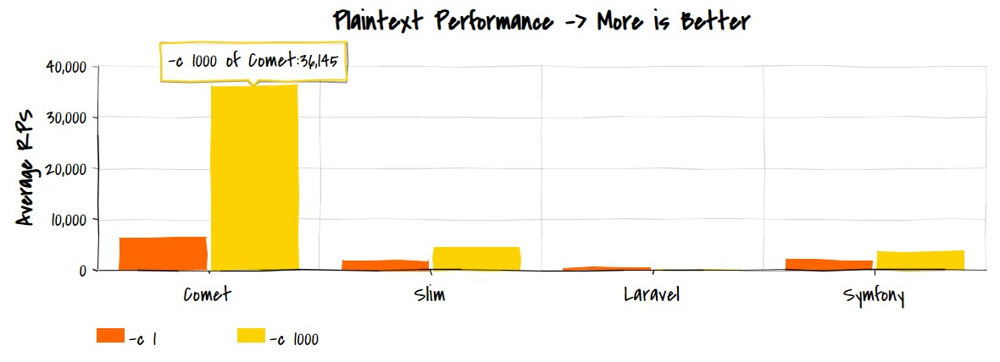
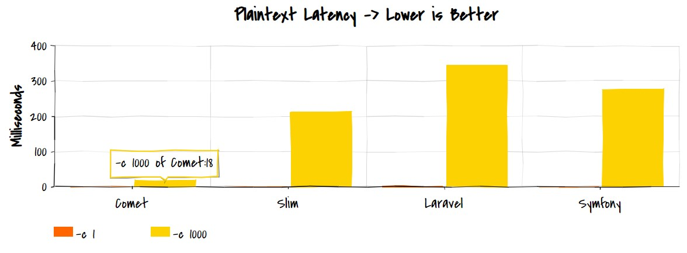

<p align="center">
  
</p>

# Comet

Comet is a modern PHP framework for building fast REST APIs and microservices.

## Superpowers

Comet gets all superpowers from Slim microframework and Workerman library as well as adds it's own magic sauce.

[Slim](https://github.com/slimphp/Slim) is a micro-framework that helps write simple yet powerful web applications and APIs based on modern PSR standards.

[Workerman](https://github.com/walkor/Workerman) is an asynchronous event-driven framework. It deliver high performance to build fast and scalable network applications. Workerman supports HTTP, Websocket, SSL and other custom protocols. 

## Performance and Latency

PHP is often criticized for its low throughput and high latency. But that's not necessarilty true for modern frameworks. Let's see how Comet outperfroms others.

<p align="center">
  
</p>

As you can see, the right architecture provides it with tenfold advantage over Symfony and other popular frameworks.

<p align="center">
  
</p>

Comet provides sub-millisecond latency for typical use cases. Even under hard pressure of thousand concurrent connections it can compete with frameworks of compiled platforms like Go and Java.

## Installation

It's recommended that you use [Composer](https://getcomposer.org/) to install Comet.

```bash
$ composer require gotzmann/comet
```

This will install framework itself and all required dependencies. Comet requires PHP 7.1 or newer.

## Basic Usage

Comet itself is and hybrid app that allows you to use any methods and data structures of Slim framework: http://www.slimframework.com/docs/v4/

## PSR-4 and Autoloading

Before you proceed with complex examples, be sure that your composer.json contains autoload section like this:

```bash
    "autoload": {
        "psr-4": { "\\": "src/" }
    }
```    

If not, you should add the section mentioned above and update all vendors packages and autoload logic by command:

```bash
$ composer install
```    


### Simple Hello Comet

Create single app.php file at project root folder with content:

```php
<?php

use Comet\Comet;

require_once __DIR__ . '/vendor/autoload.php';

$app = new Comet();

$app->get('/hello', function ($request, $response, $args) {
	  $response->getBody()->write("Hello, Comet!");      
    return $response;
});

$app->run();
```

Start it from command line:

```bash
$ php app.php start
```

Then open browser on type default address http://localhost:80 - you'll see hello from Comet!

### Simple JSON response

Let's start Comet server listening on custom port and returning JSON payload.

```php
<?php

use Comet\Comet;

require_once __DIR__ . '/vendor/autoload.php';

$app = new Comet([
    'host' => 'localhost',
    'port' => 8080
]);

$app->get('/json', function ($request, $response, $args) {    
    $object = new stdClass();
    $object->data = [ "code" => 200, "message" => "Hello, Comet!" ];
    $payload = json_encode($object);
    $response->getBody()->write($payload);
    return $response
        ->withHeader('Content-Type', 'application/json');
});

$app->run();
```

Start Postman and see the JSON resonse from GET http://localhost:8080

### Simple CRUD controller

Create src/Controllers/SimpleController.php:

```php
<?php

namespace Controllers;

use Slim\Psr7\Request;
use Slim\Psr7\Response;

class SimpleController
{    
    private static $counter = 0;

    public function getCounter(Request $request, Response $response, $args)
    {
        $response->getBody()->write(self::$counter);  
        return $response->withStatus(200);
    }

    public function setCounter(Request $request, Response $response, $args)    
    {        
        $body = (string) $request->getBody();
        $json = json_decode($json);
        if (!$json) {
            return $response->withStatus(500);
        }  
        self::$counter = $json->counter;
        return $response;        
    }
}  
```    

Then create Comet server app.php at project root folder:

```php
<?php

use Comet\Comet;
use Controllers\SimpleController;

require_once __DIR__ . '/vendor/autoload.php';

$app = new Comet([
    'host' => 'localhost',
    'port' => 8080
]);

$app->setBasePath("/api/v1"); 

$app->get('/counter',
    'Controllers\SimpleController:getCounter');

$app->post('/counter',    
    'Controllers\SimpleController:setCounter');

$app->run();
```

Now you are ready to get counter value with API GET endpoint:

GET http://localhost:8080/counter

You can change counter sending JSON request for POST method:

POST http://localhost:8080/counter with body { "counter": 100 } and 'application/json' header

Any call with mailformed body will be replied with HTTP 500 code, as defined at controller logic.

## Docker and Nginx

Please see [Dockerfile](Dockerfile) at this repo as starting point for creating your own app images and containers.

If you would like to use Nginx as reverse proxy or load balancer for your Comet app, insert into nginx.conf these lines:

```php
http {
 
    upstream app {
        server http://path.to.your.app:port;
    }
  
    server {
        listen 80;
         location / {
            proxy_pass         http://app;
            proxy_redirect     off;
        }
    }
}    
```
